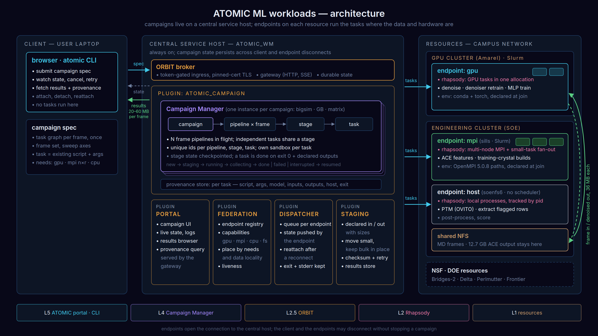
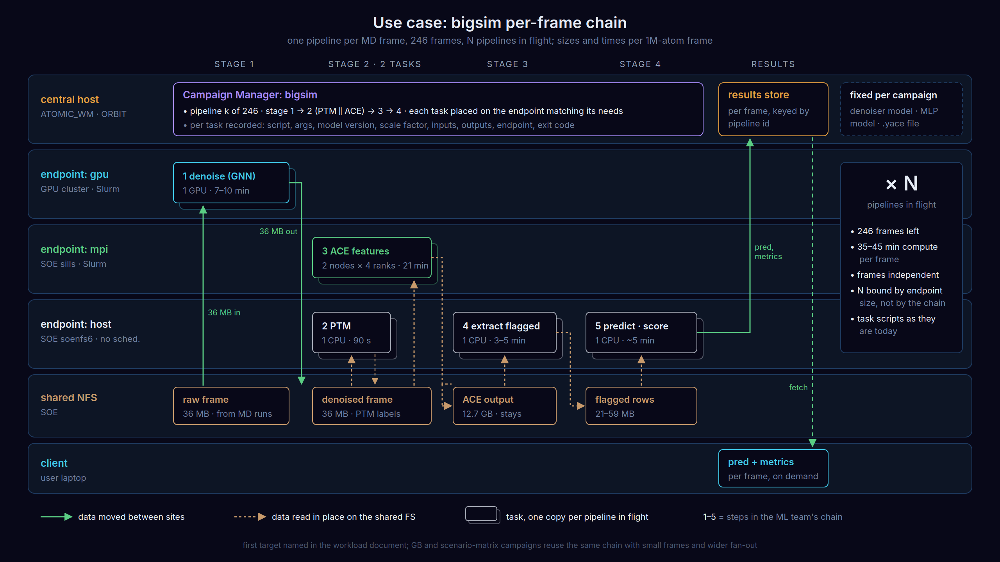

# ATOMIC ML workloads on ATOMIC_WM — call prep

2026-10-02.

Goal of the call: agree a development line that runs the bigsim chain on the
stack we demoed on 2026-09-08, and the order of the work after it.

## 1. Workload digest

- **Science:** defect detection in MD snapshots. Frames come from Qianqian's
  LAMMPS runs on SOE NFS. No ML → MD feedback today.
- **Per-frame chain:**
  1. denoise: GNN, Amarel, 1 GPU.
  2. PTM: OVITO, soenfs6, 1 CPU.
  3. ACE features: LAMMPS+PACE, SOE sills, 2 nodes × 4 MPI ranks.
  4. extract flagged rows: soenfs6.
  5. table, MLP predict, post-process, score: laptop.

  Steps 2 and 3 are independent.
- **Sizes per 1M-atom frame:** 36 MB in, 12.7 GB ACE intermediate, 21–59 MB extracted.
- **Workloads:**

  | Workload | Atoms per frame | Shape | Status |
  |---|---|---|---|
  | Scenario matrix | ~4k | 1,820 two-minute feature tasks, 270 MLP trainings | done |
  | Grain boundaries | 4–7k | 88 frames at ~4 min, serial today | 2 boundaries done |
  | Bigsim | ~1M | 35–45 min compute per frame, 246 frames left | demo done |

- **Side tasks:** denoiser retraining, 3–4.5 h on 1 GPU. Training-crystal
  builds, 140 crystals per dataset, one SOE task each.
- **Machines:** Amarel (GPU), SOE sills (MPI), soenfs6 (no scheduler, NFS head
  node), laptop. Environments are hand-built. All hosts are behind the campus
  VPN.
- **Today's glue:** shell scripts over ssh and rsync, driven from the laptop.
  Provenance lives in two hand-kept documents per project.
- **First target, proposed by the ML team:** the bigsim chain on the remaining
  frames. Baseline: ~1.5 h of compute and ~4 h wall clock for two frames.

## 2. Architecture

- **Central service host:** always on. It holds the campaigns, one Campaign
  Manager instance per campaign (bigsim, GB, matrix), and the ATOMIC portal.
  It decides where each task runs and keeps the record of what ran.
- **Endpoints:** one per resource and hardware type, started under the user's
  account:
  - `gpu`: denoise, denoiser retraining, optionally MLP training;
  - `mpi`: ACE features, training-crystal builds;
  - `host`: PTM, extract, predict, score.
- **Resources:** the figure shows today's machines. The SOE machines will
  likely be replaced by NSF and DOE systems: Bridges-2, Delta, Perlmutter,
  Frontier. These systems already run our stack in AmSC. What needs checking is
  software availability on each: LAMMPS with PACE, OVITO, PyTorch.
- **Data:** tasks run where their data is. The 12.7 GB ACE output never leaves
  the file system it was written to. Only the 36 MB frames and the 20–60 MB
  results move between sites.
- **Client:** a browser on the portal, or the atomic CLI. It submits, watches,
  fetches results and queries provenance. It runs no task, and it may
  disconnect without stopping a campaign.

## 3. Use case: bigsim

- **Pipelines:** one per frame. Many frames run at once; the endpoint sizes
  bound how many, not the chain.
- **Stage 2:** PTM and ACE run in parallel.
- **Data:** the raw frame goes to the GPU endpoint and the denoised frame comes
  back. The steps after that read their inputs in place.
- **Scripts:** each task is one of the ML team's existing scripts.
- **Fixed inputs:** the models and the descriptor file are fixed per campaign
  and recorded with every result.

## 4. How the architecture answers "What breaks" (§6 of the document)

| # | Break | Answer in the architecture |
|---|---|---|
| 1 | laptop is the controller; VPN drops kill it | the controller is the always-on central host; the laptop is a client and may disconnect |
| 2 | fixed staging names force one frame at a time | every task gets its own working directory and a unique id; many frames run at once |
| 3 | tag collisions mix runs silently | tags are derived from the pipeline id, never chosen by hand |
| 4 | results visible 2–3 min after Slurm reports COMPLETED | completion is reported from where the task ran, once its outputs exist |
| 5 | `pgrep` matched its own ssh command | the endpoint starts each process itself and knows its state; no remote process probing |
| 6 | 12.7 GB intermediates | tasks run next to their data; only declared small outputs move |
| 7 | hand-built environments, stripped login shell | the environment is set up once per endpoint, plus an optional setup step per task |
| 8 | silent failures, provenance drift | a task counts as done only on success with all outputs present; provenance is recorded for every task |

## 5. Draft answers to the ML team's questions (§8 of the document)

1. **Scripts as executables:** yes, as they are. Inputs that are implicit today
   (tag, staging paths, model paths) become explicit arguments. The validated
   logic does not change.
2. **Where the manager runs:** on the central host. The laptop is not needed
   after submission. Slurm clusters and hosts without a scheduler both work.
3. **Data movement:** each task declares its inputs and outputs. The 12.7 GB
   stays on the cluster; only the frames and the results move.
4. **Network drop:** campaigns live on the central host and continue through
   client disconnects. Resuming tasks across endpoint reconnects is part of the
   development line (§6).
5. **1,820 small tasks:** yes. They run as many tasks inside one allocation.
6. **GPU and MPI tasks:** each task states what it needs: GPUs, nodes, ranks.
   Multi-node MPI tasks are supported. A per-task setup step covers the
   environment exports.
7. **State and provenance:** recorded per task: script, arguments, model
   version, scale factor, noise level, inputs, outputs, resource, exit status,
   times. Queryable from the portal and the CLI. The field list needs
   agreement with the ML team.
8. **Credentials:** endpoints start under the user's own account and keys.
   After that they connect to the central host over an authenticated channel.

## 6. Development line (proposal)

Each step ends with a run the ML team can check against their numbers.

1. **Bigsim on the demo stack:** the chain as one campaign, with their scripts
   unchanged. 2 frames first, compared with the ~4 h baseline, then the
   remaining frames.
2. **Robustness:** resume after network loss and service restarts; outputs
   checked before a task counts as done.
3. **Provenance:** agree the recorded fields with the ML team; query them from
   the portal.
4. **Campaign Manager integration:** the Rutgers Campaign Manager drives the
   campaigns on the central host.
5. **More resources:** NSF and DOE systems in place of or next to SOE, after
   the software check.
6. **Wider fan-out:**
   - GB frames in parallel;
   - the 1,820 training-crystal tasks under one allocation;
   - MLP training as cluster tasks (270 runs).

## 7. Open points for the call

- **Central host location:** r3 sits outside the campus network. A
  Rutgers-hosted VM sits inside it. The deciding question is whether the
  compute nodes can open outbound connections to r3.
- **Compute approvals:** the status of what Ryan is chasing with Ileny.
- **Access:** accounts on Amarel, SOE and the NSF and DOE systems for running
  endpoints. Use the ML team's allocation, or ours?
- **Software on NSF and DOE systems:** LAMMPS with PACE, OVITO and PyTorch;
  installed by the sites, or built by us.
- **Code and data:** the GitHub repository Yating announced for the week of
  09-21. Which revision of the scripts counts as validated?
- **Test data:** Qianqian's MD frames, and the separate thread Ryan opened on
  test files.
- **Who owns the campaign spec:** the ML team writes it with our templates, or
  we write it with them.
